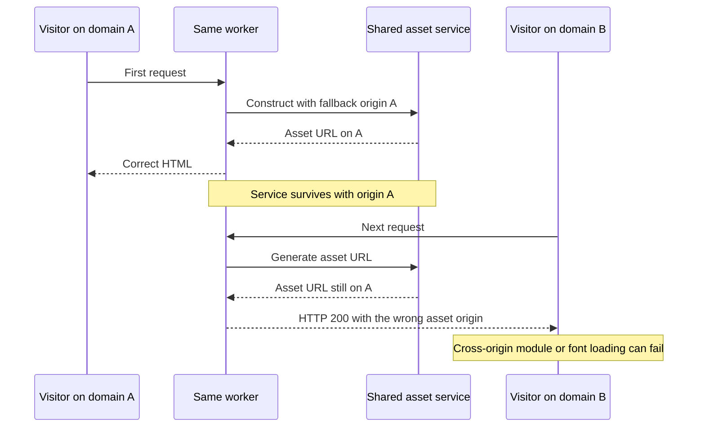

# Shopware compatibility findings — 2026-09-30

> Historical record from 2026-09-30 / 2026-10-01. Commands, findings and upstream statuses describe that experiment, not the current lab. Use the [archive overview](../README.md) and [current setup](../../../../README.md) for orientation.
[Overview](../README.md)

This is an evidence log for the tested checkout, not a claim about every Shopware release. Upstream statuses were checked on 2026-09-30 and must be rechecked before adoption. General extension guidance lives in [the worker model](../../../worker-model.md); machine-specific failures live in [the local lane reference](https://github.com/BrocksiNet/shopware-dev/tree/main/frankenphp).

## Readiness at a glance

**Experimental; not ready for a production recommendation.** This is a dated
assessment of this installation, not a support statement for every Shopware
version or extension. Last verification: 2026-09-30.

| Area | Evidence / status | Next step |
| --- | --- | --- |
| Kernel lifecycle | This checkout includes PR #19121 plus the local plugin-init correction | Both are needed for the tested baseline; see [No plugin is loaded on HTTP requests (PR #19121 as-is)](compatibility.md#no-plugin-is-loaded-on-http-requests-pr-19121-as-is) and [Services never reset, state leaks between requests (trunk)](compatibility.md#services-never-reset-state-leaks-between-requests-trunk) |
| Additional runtime fixes | Twig globals PR #21031 was not included in this checkout | Apply/review upstream fixes and repeat the checks on the resulting version |
| Basic storefront and sessions | Cart and customer/anonymous isolation checks pass on the tested routes | Run the verifier with your own theme, extensions and test account |
| Multiple storefront domains | Confirmed failure; reproduction and issue are in [Asset URLs retain another request host in worker mode](compatibility.md#asset-urls-retain-another-request-host-in-worker-mode) | Fix and re-test both request orders on fresh workers |
| Memory / worker lifetime | Memory growth and throughput decline observed without recycling; a short recycling follow-up stayed faster ([Concurrent Admin API benchmark: HTTP/2 and HTTP/1.1](performance.md#concurrent-admin-api-benchmark-http2-and-http11)) | Identify retained state and run a long soak; recycling is a mitigation |
| Full customer journey | Registration, discounts, order creation and payments not verified in this audit | Exercise the complete checkout with test payment methods |
| Failure recovery and operations | Idle DB reconnect, failed transactions, deployment/rollback not verified end to end | Test failure paths and worker replacement before a production trial |
| Performance | Storefront latency and concurrent Admin HTTP/2 throughput measured; worker lifetime affects results ([Concurrent Admin API benchmark: HTTP/2 and HTTP/1.1](performance.md#concurrent-admin-api-benchmark-http2-and-http11)) | Validate sustained performance after lifecycle fixes; PHP/Caddy builds still differ |

## Known issues and troubleshooting

Tracking epic: [#13921 Ensure compatibility with long running envs like FrankenPHP](https://github.com/shopware/shopware/issues/13921)
with sub-issues [#14455](https://github.com/shopware/shopware/issues/14455) (test suite
prepared for resets) and [#14456](https://github.com/shopware/shopware/issues/14456)
(restore Symfony's kernel lifecycle, PR [#19121](https://github.com/shopware/shopware/pull/19121)).
Earlier attempt: PR [#14345](https://github.com/shopware/shopware/pull/14345) (closed, split up).

## No plugin is loaded on HTTP requests (PR #19121 as-is)

Symptom: plugins work in `bin/console` but not over HTTP (FPM and FrankenPHP).
No error. The container in `var/cache/prod_h*` has `kernel.active_plugins => []`.

Cause: `Symfony\Component\HttpKernel\Kernel::handle()` calls `preBoot()`
(registers bundles, builds the container) **before** `boot()`. Shopware
initializes plugins in its `boot()` override, so they are initialized after the
bundles were registered. `KernelPluginLoader::getBundles()` silently returns
nothing when it is not initialized. CLI and the PR's test call `boot()` first,
which hides it.

Fix (in `pr-19121-plugin-init-fix.patch`, includes a regression test that fails
without it): keep a thin override that boots first and then delegates.

```php
public function handle(Request $request, int $type = self::MAIN_REQUEST, bool $catch = true): Response
{
    $this->boot();

    return parent::handle($request, $type, $catch);
}
```

## Services never reset, state leaks between requests (trunk)

`Shopware\Core\Kernel::handle()` bypassed Symfony's request bookkeeping, so the
`services_resetter` never ran. Visible with the probe as `X-Probe-Leaked-Path`
and a growing escape cache: [#19272](https://github.com/shopware/shopware/issues/19272)
(`CachedEscaperRuntimeResetter` exists but never runs, workers die with
`Allowed memory size exhausted`), [#14457](https://github.com/shopware/shopware/issues/14457)
(SwTwigFunction leak). Fixed by #19121 (+ [No plugin is loaded on HTTP requests (PR #19121 as-is)](compatibility.md#no-plugin-is-loaded-on-http-requests-pr-19121-as-is)).

## Remaining memory growth per storefront request

Even with resets working, a warm worker grows about 7 to 11 KB per storefront
request (more without a session cookie, since every request creates a new
context). Not caused by the known static caches: `EntityHydrator`, `Profiler`,
`ScriptTraces`, `IconCacheTwigFilter`, `SwTwigFunction`, the escape cache, the
event dispatcher listener count and the declared class count all stay constant.
Open. Next step: heap snapshots (e.g. `php-meminfo`) of a worker after 100 and
after 1000 requests. Mitigation: `FRANKENPHP_LOOP_MAX`.

## `MySQL server has gone away` / error 4031 after idle time

The worker keeps its DB connection. After `wait_timeout` the server drops it and
the next request fails. [#14313](https://github.com/shopware/shopware/issues/14313)
(closed). As of trunk 2026-09 `MySQLFactory` has no idle reconnect (PR #14345
proposed `idle_connection_ttl`). Keep `wait_timeout` above the longest idle
period, or recycle workers.

## Primary/replica connection stays on the primary

After a write the replica connection switches to the primary and stayed there
for the rest of the worker's life. [#18856](https://github.com/shopware/shopware/issues/18856),
fixed by [#18857](https://github.com/shopware/shopware/pull/18857) (merged
2026-09-10). Its request/message event subscriber switches back to the replica
independently of `kernel.reset`; it also enables DBAL `keepReplica` so the
replica connection remains distinct. Replica behavior was not re-tested here.

## Plugin lifecycle and config changes are not picked up

Verified: after `plugin:deactivate` via CLI, FPM stops serving the plugin
immediately, workers keep serving it until they are restarted
(`POST localhost:2019/frankenphp/workers/restart`). Same for activate, install,
update, `.env` and `config/packages` changes.

## `public/index.php` checks only run at worker start

The front controller checks `install.lock` (installer redirect) and
`files/update/update.json` (maintenance page) inside the closure that creates
the kernel. In worker mode that closure runs once per worker start, so:

- maintenance mode during an update is not shown by running workers,
- without `install.lock` the closure sends a redirect and calls `exit` during
  worker start, so the worker crash-loops. Install first, then start workers.

## Asset URLs retain another request host in worker mode

The following sequence illustrates this specific finding, reported in
[#21063](https://github.com/shopware/shopware/issues/21063).



Observed on `music-de.localhost:8106`: script and font URLs point at
`music.localhost:8106`. Chrome blocks the cross-origin module
`/bundles/storefront/storefront/shopware/shopware.js` and two Inter fonts because
the asset responses lack `Access-Control-Allow-Origin`. HTTP 200 for the page
therefore does not mean the storefront works correctly.

A repeated `/account/login` check emitted `music.localhost:8106` script URLs in
20/20 worker responses. The same checkout/database through FPM on
`music-de.localhost:8105` emitted its own host in 20/20 responses. Earlier worker
requests sometimes emitted the correct host, so behavior can vary by worker.
Raw host counts: [`asset-hosts.json`](../measurements/2026-09-30/asset-hosts.json).

Confirmed with fresh single-worker sequences and reported as
[#21063: Asset fallback URLs retain the first request host in long-running workers](https://github.com/shopware/shopware/issues/21063).

After restarting the worker, A → B → A → B requests to `/account/login` all
emitted A's script origin. Restarting again and reversing the order made all
responses emit B's origin. Both the bundle module and theme storefront script
were affected. Service-reset counters increased from 0 to 3 in each sequence;
the probe's own leaked-path check stayed empty. No themes were recompiled or
configuration changed between the two sequences. HTTP caching was disabled.
The original five-worker setup was restored afterwards.

Raw evidence:
[`fresh-worker-asset-hosts.json`](../measurements/2026-09-30/fresh-worker-asset-hosts.json).

The reusable verifier also detects this issue: a run against domain A, domain B,
then A exited with status 1 and reported three asset-origin failures on B
([JSON report](../measurements/2026-09-30/verification-domains.json)). Cart and login
were intentionally skipped in that focused run. This check used the existing
five workers; the fresh single-worker evidence above establishes the request
ordering separately.

The focused unit test confirms the mechanism independently of Twig or
FrankenPHP: `FallbackUrlPackage` resolves an empty base URL from the request
in its constructor, then keeps that origin when the `RequestStack` changes.
The shared lazy asset services in `DependencyInjection/filesystem.php` are not
reset. `ThemeAssetPackage` also extends this class and does not forward its
request stack to the parent constructor; a fix should cover that path too.

Regression tests were added to
`tests/unit/Core/Framework/Asset/FallbackUrlPackageTest.php` in the swfp checkout.
The fallback-host test intentionally fails: expected `https://second.example/test`,
actual `https://first.example/test`. The explicit-CDN control and four existing
tests pass (6 tests, 8 assertions, 1 expected reproduction failure). Scoped
coding-style and PHPStan checks pass. No production fix was applied.

The issue includes the full patch and commands so another developer/agent can
reproduce without this local setup. Local patch:
[`fallback-url-worker-reproduction.patch`](../fallback-url-worker-reproduction.patch).

```bash
podman compose exec -T web vendor/bin/phpunit \
  --testsuite unit --filter FallbackUrlPackageTest
```

### Docker starter follow-up — 2026-10-01

A clean worker-mode starter reproduced the same origin retention with an internal
health check on `localhost:8000`, followed by public requests on `localhost:8080`.
The verifier found three wrong-origin responses. An explicit public Host header
on the health check avoids introducing that second origin; it is not a fix to the
shared service. This is documented with the public lab's compatibility notes.

## Upstream compatibility status — checked 2026-09-30

GitHub searches in `shopware/shopware` covered open PRs matching `FrankenPHP`,
`long running`, `worker` and `reset`; these are the relevant findings:

| Item | Status | Relevance |
| --- | --- | --- |
| [#13921](https://github.com/shopware/shopware/issues/13921) | open epic | Long-running runtime compatibility remains tracked work |
| [#19121](https://github.com/shopware/shopware/pull/19121) | open PR | Restores Symfony service resets; this checkout includes the PR plus the local plugin-init fix in [No plugin is loaded on HTTP requests (PR #19121 as-is)](compatibility.md#no-plugin-is-loaded-on-http-requests-pr-19121-as-is) |
| [#21031](https://github.com/shopware/shopware/pull/21031) | open PR | Calls `resetGlobals()` from Twig reset; request-dependent controller/theme/navigation/context globals otherwise persist; absent from this checkout |
| [#21032](https://github.com/shopware/shopware/pull/21032) | open PR | Isolates integration tests that polluted shared Twig globals; test hygiene, not a standalone runtime fix |
| [#18857](https://github.com/shopware/shopware/pull/18857) | merged 2026-09-10 | Replica switching fix, independent of kernel service resets |
| [#19272](https://github.com/shopware/shopware/issues/19272) | closed issue | Escape-cache report; closed status alone does not establish compatibility of this checkout |
| [#21061](https://github.com/shopware/shopware/pull/21061) | open PR | Related cache-hash consistency across plugin loaders; not specific to FrankenPHP |

The current lane is **partially functional, with a confirmed browser failure**.
The successful cart/account isolation checks and lower backend latency do not
establish general Shopware or extension compatibility. Before a production
trial: resolve the issues documented above, include and validate the kernel/Twig fixes,
then repeat multi-domain/theme, checkout/payment, Admin/API, idle-connection and
long-duration memory tests against the exact deployment and extensions.
