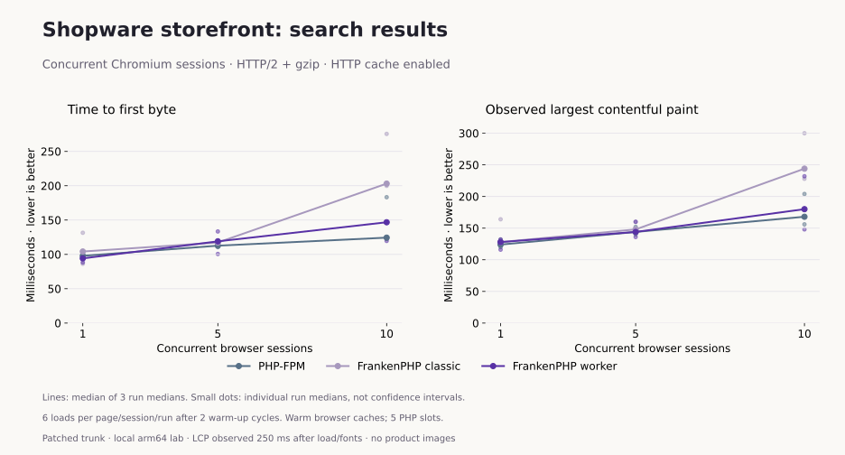
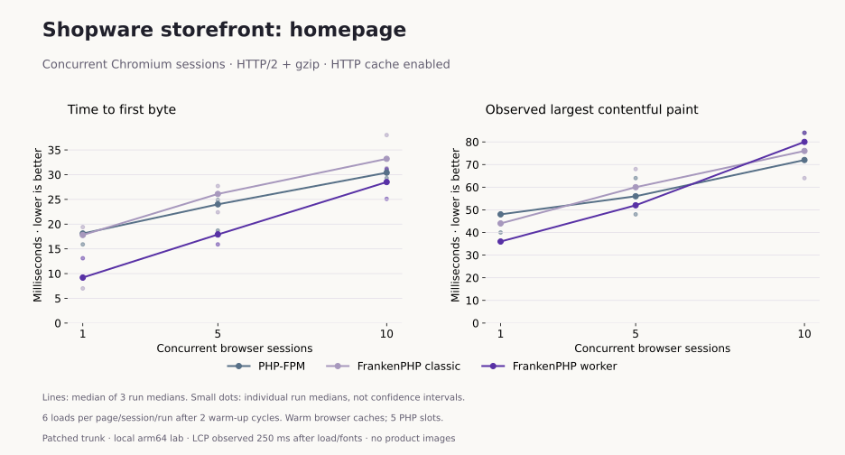
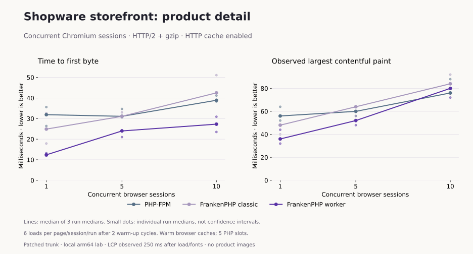

# Concurrent storefront browser results

Measured 2026-10-01. **2,592 measured navigations and 864 excluded warm-up
navigations passed**, across 27 runs. Zero browser/content/network failures,
no retries and no skipped pages. The lab was restored to classic mode afterwards.

The later [populated music-shop experiment](music-browser-measurements.md) checks
real product images on existing installations. It uses different builds and
HTTP/1.1, so its samples are not combined with this matrix.

## Configuration

- Shopware development commit `868f25121f764f41d6490fd032d6f28507be4e43`, with the
  plugin-init and Monolog reset patches on all three runtimes.
- Shopware Docker images pinned in `benchmark.env`; PHP 8.4.26, five PHP execution
  slots, production mode, debug off and worker recycling disabled.
- Local HTTPS/HTTP/2 with gzip enforced; Shopware HTTP cache enabled.
- 1, 5 and 10 isolated Chromium sessions; two warm-up cycles and six measured
  homepage/search/product cycles per session, three repeats, rotated runtime/load order.
- Warm browser asset caches and guest sessions; shared Shopware caches retained.
- Chromium 153.0.8010.12; Apple M4 Pro host, 14 logical CPUs.
  Browsers and the ARM64 server VM share the development machine; no network or
  CPU throttling. This is not an isolated server-capacity measurement.

The [run guide](browser-benchmarking.md) explains setup, commands, observation
windows and failure handling. The [matrix](results/2026-10-01-browser-h2/matrix.json)
references every raw run; the [summary](results/2026-10-01-browser-h2/summary.json)
contains all metrics, per-run p50 values and median-run p95 values.

## Ten concurrent browser sessions

Values below are the median of three run p50 values. Within each run, quantiles
use nearest rank. Each route contributes 60 measured page loads per run at this
load level. Units are milliseconds; lower is better.

| Page | FPM TTFB / observed LCP | Classic TTFB / observed LCP | Worker TTFB / observed LCP |
| --- | ---: | ---: | ---: |
| Homepage | 30.4 / 72.0 | 33.2 / 76.0 | 28.5 / 80.0 |
| Search results | 124.4 / 168.0 | 203.1 / 244.0 | 146.8 / 180.0 |
| Product detail | 38.9 / 76.0 | 42.5 / 84.0 | 27.3 / 80.0 |

## How timings change with concurrency

Lines show the median of three run p50 values; small dots retain individual run
p50 values. The dots are not confidence intervals. These figures replace the
initial single-navigation smoke timings for comparison.

### Search results

### Homepage

### Product detail

## Search-page detail

| Sessions | Runtime | TTFB | FCP | DOMContentLoaded | Load | Observed LCP |
| ---: | --- | ---: | ---: | ---: | ---: | ---: |
| 1 | fpm | 97.9 | 124.0 | 114.8 | 124.0 | 124.0 |
| 1 | classic | 104.2 | 128.0 | 119.8 | 129.9 | 128.0 |
| 1 | worker | 94.2 | 128.0 | 115.0 | 126.7 | 128.0 |
| 5 | fpm | 112.7 | 144.0 | 131.3 | 140.2 | 144.0 |
| 5 | classic | 117.3 | 148.0 | 138.5 | 144.3 | 148.0 |
| 5 | worker | 119.0 | 144.0 | 139.4 | 145.9 | 144.0 |
| 10 | fpm | 124.4 | 168.0 | 168.9 | 172.6 | 168.0 |
| 10 | classic | 203.1 | 232.0 | 230.0 | 237.9 | 244.0 |
| 10 | worker | 146.8 | 180.0 | 170.9 | 178.4 | 180.0 |

## Interpretation and limits

At ten sessions, workers had lower product-page TTFB (27.3 ms versus FPM's
38.9 ms), but observed LCP was 80 ms versus 76 ms. On search, FPM's median-run
TTFB was 124.4 ms versus 146.8 ms for workers and 203.1 ms for classic. Individual
search run medians overlapped substantially: FPM 122.5–183.3 ms; worker
119.6–202.3 ms. Three repeats do not establish a universal runtime ranking.

The Admin API throughput multiplier does not transfer to these browser pages.
The FPM image uses NTS PHP on Alpine, while FrankenPHP uses ZTS PHP on Debian;
matching the PHP version does not isolate the worker lifecycle from every other
stack difference.

All 2,592 responses carried an `Age` header and `Cache-Control: no-cache, private`.
We record the cache-enabled configuration and headers; this experiment does not
isolate a full-page cache-hit ratio or time spent in each caching layer.

Observed LCP is the latest entry after load/font readiness plus 250 ms, not a
full visit or field Core Web Vitals measurement. The observed elements are text
and the starter logo. The fixture has no product photography and the homepage
has little content. FCP/LCP under concurrent headless browsing also include
client rendering contention. No INP, CLS, mobile network or cold-browser study
was performed.

Navigation throughput includes the observation pause, browser work and synchronized
rounds; it is not PHP requests/second. A successful page validates only the
checked route, assets and fixture markers, not all fields, extensions, multiple
domains, authenticated customer state, checkout or payments.

The interrupted exploratory run with image-default compression (FPM gzip,
FrankenPHP Zstandard) is excluded. Only the complete gzip-controlled matrix
above contributes to these charts. The earlier correctness suite remains in
[the testing guide](testing.md).
