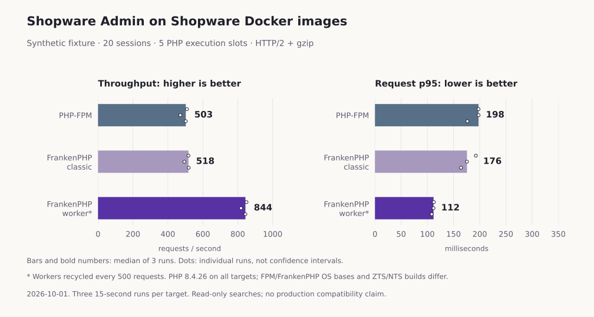

# Recorded runtime comparisons

## Public synthetic fixture on Shopware images

Measured 2026-10-01 using this repository's optional fixture and
[three-runtime setup](benchmarking.md). These results are separate from the older
populated-shop experiment below. All targets share code, data, five execution
slots, prod/debug off and disabled HTTP cache. Workers recycle at 500 requests.

Both images use PHP 8.4.26 and Caddy 2.11.4. FrankenPHP is 1.12.7, with ZTS PHP
on Debian 13; the Caddy/FPM image uses NTS PHP on Alpine 3.24.2. This compares
Shopware's shipped stacks, not just a single isolated runtime variable.

Hardware: Apple M4 Pro host, an ARM64 Linux container VM with 8 CPUs and about
15.6 GiB RAM. The Node load generator runs on the host. Other development containers
and light tooling were present; this was not a dedicated benchmark machine.
Versions and resolved image digests are in the
[environment record](results/2026-10-01/environment.json).

### HTTP/2 with gzip

Three repeats at each load level, 3 seconds warm-up and 15 seconds measured per
run. The targets run sequentially with alternating order. Each session issues four
parallel read-only searches with no think time. These are synthetic sessions, not
equivalent numbers of human Administration users.

| Sessions | FPM req/s | Classic req/s | Worker req/s | FPM p95 | Classic p95 | Worker p95 |
| --- | --- | --- | --- | --- | --- | --- |
| 1 | 299.3 | 307.1 | 419.0 | 13.3 ms | 13.2 ms | 9.3 ms |
| 5 | 536.0 | 522.0 | 814.1 | 41.7 ms | 43.8 ms | 33.3 ms |
| 20 | 502.6 | 517.8 | 844.0 | 197.7 ms | 175.6 ms | 111.8 ms |

Cells are medians of three run-level results; latency percentiles are not pooled.
All **213,744 measured responses** in 27 runs passed status, HTTP/2 and entity
ID/total validation. Every measured response was gzip encoded. Mean compressed
body size was 3,356.75 bytes across the four equally represented endpoints on all
three runtimes. These checks do not establish equality of every response field.

At 20 sessions, individual throughput results ranged from 471.3 to 509.4 req/s
for FPM, 494.6 to 519.3 for classic and 818.5 to 850.2 for workers. The overlapping
FPM/classic ranges do not justify a strong claim that one is faster. Worker median
throughput was 1.68 times FPM and 1.63 times classic for this workload.

The [run summary](results/2026-10-01/lab-h2-gzip-summary.json) retains each run,
including p99 latency, wire-body sizes, CPU time and memory snapshots.

Median web-container CPU seconds per 1,000 validated requests were **8.54 for FPM,
8.07 for classic and 4.92 for workers**. This excludes database/client CPU and is
not a hosting-cost calculation. End-of-run container memory snapshots at 20 sessions
ranged from 142.2–166.6 MiB for FPM, 128.0–154.6 MiB for classic and 137.5–138.5 MiB
for workers. These are cgroup memory charges including cache, not peaks or PHP heap
measurements, and do not establish long-term stability.

### HTTP/2 without compression

The sequential control used the same targets, fixture, 20 sessions, warm-up,
duration and three repeats, with `Accept-Encoding: identity`:

| Runtime | Median req/s | Range across runs | Median run p95 |
| --- | --- | --- | --- |
| Caddy + FPM | 451.6 | 435.3–461.9 | 194.6 ms |
| FrankenPHP classic | 416.5 | 403.9–432.1 | 230.1 ms |
| FrankenPHP worker | 630.7 | 586.8–633.3 | 149.0 ms |

All **67,504 responses** passed, with identity encoding throughout. Mean body size
was 50,978.75 bytes on every target, about 15.2 times the compressed size. Workers
still led, but at about 1.40 times FPM throughput. Larger transfers, client processing
and the server's compression path can affect this comparison; it does not isolate
which component caused each difference. The gzip and identity runs were sequential,
not a randomized interleaving of encodings.

Together, the two reports contain **281,248 validated responses in 36 runs**.
See the [identity summary](results/2026-10-01/lab-h2-identity-summary.json),
[raw gzip workload report](results/2026-10-01/lab-h2-gzip.json.gz),
[raw identity workload report](results/2026-10-01/lab-h2-identity.json.gz), and
[archive checksums](results/2026-10-01/checksums.json).

### Scope of the result

The fixture has 500 simple products, 10 manufacturers, 50 added categories,
100 synthetic guest customers and 100 media metadata placeholders. It contains
no uploaded image data or orders. It is useful for repeating the same Admin search
workload, not a model of every merchant catalog.
Including installation data, the searched totals were 500 products, 51 categories,
100 customers and 103 media records. The identity report records the preflight IDs
and totals; the earlier gzip report checked the same signatures in memory but did
not yet persist them. No data writes took place between the two benchmark commands.

Matching versions and response encodings improves comparability. OS libraries,
ZTS/NTS builds, background activity and the load generator remain confounders.
HTTP/2 cleartext excludes TLS overhead and browser behavior. Full checkout,
mutations, ACL variation, extensions and long-term worker stability remain untested.

## Earlier populated-shop experiment

Measured 2026-10-01 against a populated test shop, **not the empty catalog created
by this repository**. All runtimes used the same Shopware code/database, five PHP
execution slots, prod/debug off and HTTP cache disabled. Classic and worker mode
shared PHP 8.4.26 ZTS, FrankenPHP 1.12.7 and Caddy 2.11.4. The FPM control used
PHP 8.4.17 NTS, so it is not a perfectly isolated runtime comparison.

Each virtual session issued four parallel read-only Admin searches: products,
categories, customers and media. Separate tokens used the same administrator
account. HTTP/2 cleartext, gzip, persistent connections, no think time, 2 seconds
warm-up and 8 seconds measured per run. Targets ran sequentially with reversed
order across repeats/load levels. Three repeats per load/runtime produced 36 runs.

Worker recycling: 500 requests. Classic mode had no worker script. Previous
unrecycled workers slowed over time; these short runs do not prove stability.

| Sessions | FPM req/s | Classic req/s | Worker req/s | FPM p95 | Classic p95 | Worker p95 |
| --- | --- | --- | --- | --- | --- | --- |
| 1 | 235.8 | 218.4 | 462.9 | 18.4 ms | 18.1 ms | 8.6 ms |
| 5 | 408.0 | 320.3 | 824.6 | 55.5 ms | 70.5 ms | 26.6 ms |
| 10 | 418.8 | 333.4 | 856.4 | 105.8 ms | 130.3 ms | 48.9 ms |
| 20 | 415.8 | 330.4 | 851.3 | 199.5 ms | 255.5 ms | 100.8 ms |

Each cell is a median of three run-level results (p95 values are not pooled).
137,384 measured responses passed status, protocol and entity ID/total validation.
Those checks do not validate every response field or the complete Admin UI.

Classic was about 21% slower than FPM at 20 sessions; workers were about 2.05× FPM
and 2.58× classic. This does not imply every shop will improve, or that a server
change alone is faster. Local machine activity, PHP build differences, short runs,
fixture sizes and the absence of mutations limit generalization. Production TLS,
real user capacity, full checkout and long-term behavior were not measured.

The source tool is [admin-benchmark.mjs](../tools/admin-benchmark.mjs). These numbers
are a recorded experiment, not expected output or performance guarantees for this
starter. The original request-level reports remain with the author's experiment;
only the aggregate summary is included here. Use your own representative synthetic
data and save new reports when evaluating a deployment.
