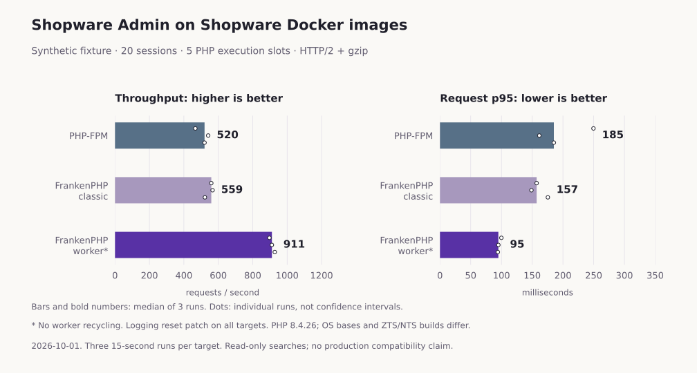
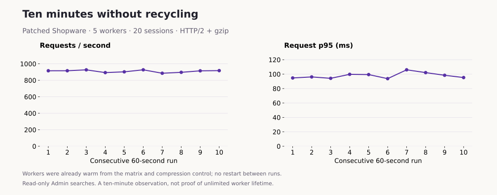

# Recorded runtime comparisons

## Logging correction with worker recycling disabled

Measured 2026-10-01 using the public synthetic fixture and Shopware's Docker
images. All three runtimes use the same pinned application source, dependencies,
database and five PHP execution slots, with production mode, debug off and HTTP
cache off. **The logging reset patch is applied to all three targets. Workers run
with `FRANKENPHP_LOOP_MAX=0`; no request-count recycling is configured.**

The patch forwards resets through three core Monolog decorators, addressing
[issue #21124](https://github.com/shopware/shopware/issues/21124). This is a locally
patched experiment, not a released fully worker-compatible Shopware version.
The [benchmark guide](benchmarking.md) includes setup and existing-volume steps.

PHP 8.4.26 and Caddy 2.11.4 are shared versions. FrankenPHP 1.12.7 uses ZTS PHP on
Debian 13; FPM uses NTS PHP on Alpine 3.24.2. Hardware: Apple M4 Pro host, ARM64
Linux container VM with 8 CPUs and about 15.6 GiB RAM. The Node client runs on the
host. Other development containers were present; this is not a dedicated machine.
See [environment and patch hashes](results/2026-10-01-no-recycling/environment.json).
No diagnostic PHP timing or heap-inspection code was installed in these runs.

### HTTP/2 with gzip

Three repeats at 1, 5 and 20 synthetic sessions. Each session issues four parallel
read-only searches with no think time. Each run has 3 seconds warm-up and 15
measured seconds. Targets run sequentially with alternating order. Workers remain
alive between repeats and load levels.

| Sessions | FPM req/s | Classic req/s | Worker req/s | FPM p95 | Classic p95 | Worker p95 |
| --- | --- | --- | --- | --- | --- | --- |
| 1 | 294.3 | 299.3 | 415.0 | 13.5 ms | 13.2 ms | 9.3 ms |
| 5 | 546.5 | 544.6 | 902.1 | 39.8 ms | 40.4 ms | 24.5 ms |
| 20 | 520.1 | 559.3 | 911.3 | 185.2 ms | 157.2 ms | 95.0 ms |

Each cell is a median of three run-level results; p95 values are not pooled.
All **224,952 measured responses in 27 runs** passed status, HTTP/2 and entity
ID/total validation. Every response used gzip; mean wire-body size was 3,356.75
bytes on each runtime. These checks do not establish equality of every field.

At 20 sessions, throughput ranged from 466.7–541.2 req/s for FPM,
522.2–566.7 for classic and 897.0–927.9 for workers. Worker median throughput
was **1.75 times FPM** and **1.63 times classic**. FPM/classic ranges overlap,
so this does not establish a general classic-mode speedup.

Median web-container CPU seconds per 1,000 validated requests were **8.24 for FPM,
7.51 for classic and 4.55 for workers**. Database and client CPU are excluded.
End-of-run container memory at 20 sessions ranged from 211.0–216.2 MiB for FPM,
147.2–148.8 MiB for classic and 164.2–166.1 MiB for workers. These are cgroup charges
including cache, not PHP heap usage, peaks or a hosting-cost calculation.

[Run-level gzip summary](results/2026-10-01-no-recycling/lab-h2-gzip-summary.json).

### HTTP/2 without compression

The same patched targets, data and still-running workers were used for a
sequential control: 20 sessions, `Accept-Encoding: identity`, three repeats,
3-second warm-up and 15 measured seconds per run.

| Runtime | Median req/s | Range across runs | Median run p95 |
| --- | --- | --- | --- |
| Caddy + FPM | 505.2 | 486.1–508.7 | 177.1 ms |
| FrankenPHP classic | 480.3 | 476.0–482.5 | 198.2 ms |
| FrankenPHP worker | 759.9 | 723.7–774.3 | 115.3 ms |

All **78,652 measured responses** passed, with identity encoding throughout.
Mean wire-body size was 50,978.75 bytes on every target, about 15.2 times the
compressed size. Workers measured 1.50 times FPM throughput. Payload transfer,
client processing and compression paths can affect the result; this does not
isolate their individual contributions. Encodings were tested sequentially.

The two comparison reports contain **303,604 validated responses in 36 runs**.
[Run-level identity summary](results/2026-10-01-no-recycling/lab-h2-identity-summary.json).

### Ten-minute worker test without recycling

After the matrix and identity control, the same five workers continued serving
20 sessions with gzip. Ten consecutive runs measured 60 seconds each, with
3-second warm-ups and report-writing gaps. There was no worker restart between
these experiments. This is ten minutes of measured traffic, not an assertion that
the request stream had no pauses.

All **546,432 measured responses** passed. Throughput ranged from **885.4 to
927.1 req/s**, with a median of **915.1 req/s**. The first minute measured 915.5
and the last 917.4 req/s. Median run p95 was 97.3 ms. End-of-run container memory
stayed between **163.6 and 165.7 MiB**, ending below the first sample.

At the end of the complete no-recycling sequence, the five thread request counters
were **140,443, 151,113, 150,001, 150,116 and 145,211**. These include warm-ups,
authentication, health checks and preceding benchmark traffic; they are not the
measured-response totals. The configured loop limit remained zero throughout.
The [thread timeline](results/2026-10-01-no-recycling/worker-timeline.jsonl) and
[long-run summary](results/2026-10-01-no-recycling/worker-soak-summary.json) retain
the observations.

This corrected build did not need a 500-request restart to avoid the earlier
progressive slowdown on this workload. Ten minutes of repeated Admin reads does
not establish unlimited lifetime or rule out retention in other application paths.

### Fresh-start recycling controls on the corrected code

After the longer run, the worker container was recreated for each of two policies.
Both used the same patched code and data, five workers, 20 sessions, gzip, three
15-second measured runs and 3-second warm-ups. The 500-request policy ran first,
then no recycling; the policies were not randomized or interleaved.

| Policy | Median req/s | Range | Median run p95 |
| --- | ---: | --- | ---: |
| Recycle after 500 requests | 940.4 | 887.4–943.1 | 93.6 ms |
| No recycling, fresh container | 851.0 | 822.2–895.1 | 108.2 ms |

All **80,568 responses** passed. The recycling control had the higher median;
the ranges overlap. These short sequential controls do **not** support a claim
that disabling recycling is inherently faster, nor establish an optimal limit.
The main three-runtime matrix and the longer run remain separate observations;
none of their samples are replaced with the best control result.

The evidence for removing the earlier workaround is narrower: the corrected
workers served far beyond 500 requests without the diagnosed progressive buffer
growth/slowdown on this workload. Operational policy still needs representative
longer testing. [500-request control](results/2026-10-01-no-recycling/recycle-500-control-summary.json),
[fresh no-recycling control](results/2026-10-01-no-recycling/no-recycling-fresh-control-summary.json).

### Raw evidence

The five reports contain **930,604 validated measured responses across 52 runs**.
Warm-ups, authentication and health checks are additional traffic.

- [Gzip matrix](results/2026-10-01-no-recycling/lab-h2-gzip.json.gz)
- [Identity control](results/2026-10-01-no-recycling/lab-h2-identity.json.gz)
- [Ten-minute worker test](results/2026-10-01-no-recycling/worker-soak.json.gz)
- [500-request recycling control](results/2026-10-01-no-recycling/recycle-500-control.json.gz)
- [Fresh no-recycling control](results/2026-10-01-no-recycling/no-recycling-fresh-control.json.gz)
- [Archive SHA-256 checksums](results/2026-10-01-no-recycling/checksums.json)

## Scope and earlier results

The fixture contains 500 simple products, 10 manufacturers, 50 added categories,
100 synthetic guest customers and 100 media placeholders. No uploaded media bytes
or orders are included. Full searched totals are 500 products, 51 categories,
100 customers and 103 media records. Both reports preserve preflight IDs/totals.
Separate tokens use the same administrator; these synthetic sessions are not
counts of supported human users. HTTP/2 cleartext excludes TLS and browser costs.

This measures read-only Admin searches. Checkout, writes, ACL isolation, customer
sessions, exception recovery, idle database connections and arbitrary extensions
require separate validation. A persistent-worker test cannot establish unlimited
safe lifetime or choose a universal recycling threshold.

The [earlier comparison with 500-request recycling](measurements-2026-10-01-recycling.md)
is preserved unchanged, including its raw data and the older populated-shop
experiment. That comparison did not have the logging patch. Do not attribute the
difference between dates/configurations solely to recycling or pool their samples.
