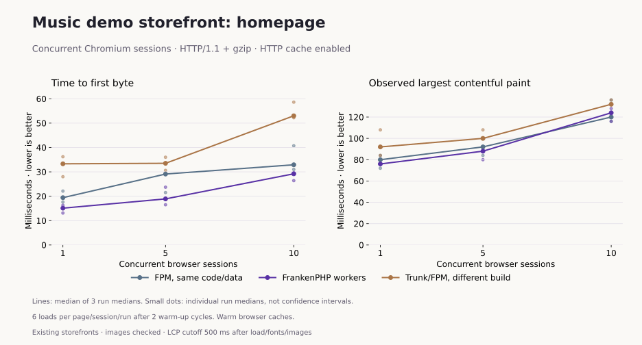
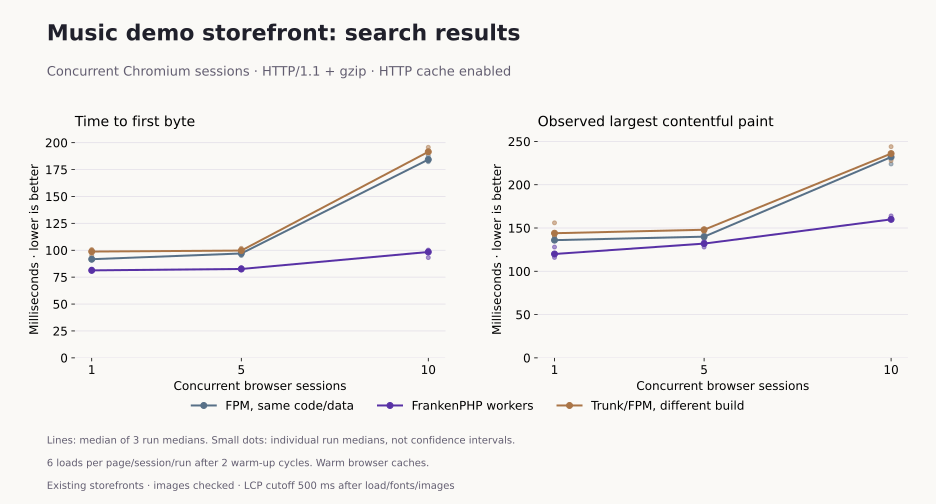
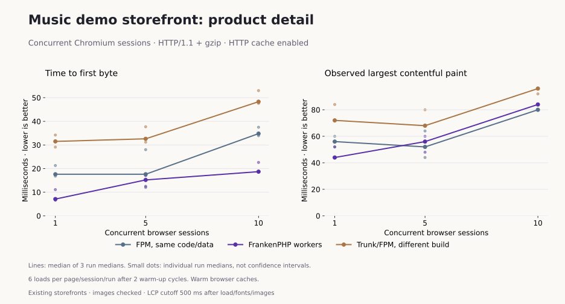

# Music storefront browser results

Measured 2026-10-01 on populated music demo shops. **All 2,592 measured navigations
and 864 excluded warm-ups passed**, across 27 runs. No retries or discarded slow
pages. Every measured LCP element was an image, and every checked visible image
loaded successfully. This is a separate dataset from the
[synthetic HTTPS/HTTP/2 fixture](browser-measurements.md).

## What was compared

| Target | Runtime and data | Important differences |
| --- | --- | --- |
| `music-de.localhost:8105` | Caddy + FPM control | PHP 8.4.17 NTS; same code/database as worker |
| `music-de.localhost:8106` | FrankenPHP workers | PHP 8.4.26 ZTS; five workers; recycling off |
| `music-trunk.localhost:8100` | Separate trunk/FPM installation | Different revision and data; English/USD instead of German/EUR |

Port **8105 is FPM**, despite initially being identified as FrankenPHP. Runtime
headers and container port mappings were checked before measuring. This experiment
does not include FrankenPHP classic mode; that comparison remains in the synthetic lab.

The same-code pair uses commit `868f25121f764f41d6490fd032d6f28507be4e43` plus
existing local kernel/plugin initialization changes. Trunk uses
`58cb2b6df1c6ed10906f2680e668786b309c4efb` plus local changes. These are development
builds, not Shopware 6.6/6.7 release results. The databases contain 578 and 581
product rows respectively, with 238 and 251 named media records. The same-code
pair shares media/theme state; trunk's branding, search ordering and data differ.
The original source of the catalogs is the same music demo family, not a verified
identical database/media snapshot.

Unlike the corrected public lab, the existing music worker **does not contain the
Monolog reset forwarding patch**. This short storefront comparison is not evidence
that the earlier worker-lifetime defect is fixed here. See the
[configuration audit](frankenphp-tuning.md) and [patched lifetime results](measurements.md).

## Method and preparation

- 1, 5 and 10 isolated Chromium sessions; three repeats with rotated target/load order.
- Two warm-up cycles, then six measured homepage/search/product cycles per session.
- Viewport 1280 × 720; warm browser asset caches and guest sessions within each run.
- Plain HTTP URLs: Chromium reported **HTTP/1.1**, not HTTP/2. The runner requests
  gzip explicitly on every target; response encoding and protocol are checked.
- Shopware HTTP caching enabled on all targets during the comparison. FPM pools
  have at most five children; FrankenPHP has five application workers. No service
  restarts during the matrix; the worker lifetime spans all three repeats.
- Production environment; debug off. No autoloader, OPcache, preload or pool tuning
  was applied for this comparison. PHP builds and server paths still differ.
- All pages must render the expected content, initialize JavaScript, load fonts,
  keep script/style/font origins correct and have no browser/network errors.
- Visible images must finish loading with nonzero natural dimensions. LCP is the
  latest entry observed 500 ms after load, fonts and visible images are ready.
  This does not cover below-the-fold lazy images or a complete shopping visit.

Preflight found a missing trunk logo; it was restored from an identical existing
media copy before measuring. An initial pilot also detected different default
compression choices (gzip versus Zstandard), so the published matrix normalizes
the browser request to gzip. Pilots are not pooled into these results.

Caching on the same-code pair was temporarily changed from off to on to match
trunk, then restored to off after the run. The five-worker, no-recycling setting
was preserved. Trunk's cache setting stayed on. No catalog was regenerated.

Chromium 153.0.8010.12 runs on the same Apple M4 Pro development host as the ARM64
server VM. There is no mobile/network throttling, CDN or isolated load generator.
Background host activity is not controlled. Synchronized page rounds and the
observation pause make navigations/second unsuitable as a server-capacity figure.

## Ten concurrent sessions

Milliseconds, lower is better. Cells are medians of three run-level statistics;
TTFB p95 is the median of run p95 values, not a pooled percentile.

| Page | Target | TTFB p50 | TTFB p95 | FCP p50 | Observed LCP p50 | DCL p50 | Load p50 |
| --- | --- | ---: | ---: | ---: | ---: | ---: | ---: |
| homepage | FPM, same code/data | 32.9 | 101.7 | 76.0 | 120.0 | 83.8 | 157.5 |
| homepage | FrankenPHP workers | 29.2 | 50.5 | 72.0 | 124.0 | 101.8 | 165.2 |
| homepage | Trunk/FPM, different build | 53.0 | 153.4 | 96.0 | 132.0 | 105.6 | 158.6 |
| search | FPM, same code/data | 184.3 | 331.1 | 216.0 | 232.0 | 212.7 | 232.3 |
| search | FrankenPHP workers | 98.4 | 207.3 | 136.0 | 160.0 | 134.8 | 160.2 |
| search | Trunk/FPM, different build | 191.5 | 332.6 | 216.0 | 236.0 | 219.2 | 240.7 |
| product | FPM, same code/data | 34.8 | 96.5 | 76.0 | 80.0 | 81.9 | 158.7 |
| product | FrankenPHP workers | 18.7 | 43.7 | 68.0 | 84.0 | 89.3 | 146.4 |
| product | Trunk/FPM, different build | 48.3 | 138.1 | 92.0 | 96.0 | 94.8 | 155.1 |

Search has the clearest difference in this sample: worker TTFB is 98 ms versus
184 ms for same-code FPM, and observed LCP is 160 versus 232 ms. The worker's lower
homepage/product TTFB does not translate into lower observed LCP: homepage is
124 versus 120 ms, and product is 84 versus 80 ms. Small visual timing differences
on a shared host do not establish a reliable ranking. Trunk/FPM is contextual,
not the control for attributing a runtime gain.

All measured pages carry an `Age` header; raw samples preserve its value and
`Cache-Control`. This does not establish a per-route cache-hit ratio or remove
dynamic work such as search from the comparison.

## Charts at every load level

Lines show the median of three run medians; dots show individual run medians,
not confidence intervals. Read the build, language and dataset differences above
before comparing trunk/FPM with the same-code pair.

## Reproduce and inspect

The [music catalog and browser guide](music-catalog.md) explains fixture preparation,
route selection and running against existing shops. The
[exact target configuration](results/2026-10-01-music-browser/targets.json) records
these local addresses and paths; substitute your own origins and catalog URLs.

The [complete matrix](results/2026-10-01-music-browser/matrix.json) links all 27
raw reports. The [summary](results/2026-10-01-music-browser/summary.json) includes
all load levels, FCP, LCP, TTFB, DCL and load statistics with run-median ranges.
Raw samples retain image paths/dimensions, LCP image, transfer size and cache headers.

Passing these read-only initial page loads does not establish checkout, multi-domain
worker safety, extension compatibility, long-term stability or production capacity.
The Admin API's 1.75× throughput result is not a storefront speed multiplier.
