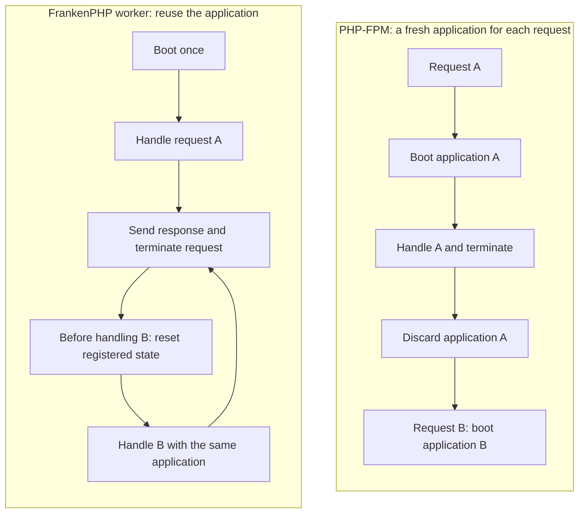

# Worker mode: application, request and session lifetimes

[Overview](../README.md)

Start here to understand what changes for Shopware services and extensions. These are general lifecycle patterns; the [current lab testing guide](testing.md) records coverage, while the [historical findings](archive/development-lab/docs/compatibility.md) describe the original development installation.

## What changes in worker mode

**A worker is a running application that handles many requests. A request is
one HTTP exchange. A customer session can span many requests and workers.**
Keeping these three lifetimes separate is the main requirement for writing
worker-compatible extensions.

## The application outlives the request

With PHP-FPM each request boots a fresh application: autoload, boot the kernel,
load the compiled container, handle the request, then discard request state.
The FPM process and OPcache can survive; PHP source is not necessarily compiled
and the container is not necessarily rebuilt for every request.

In FrankenPHP **worker mode**, the entry script and kernel are reused across
requests. The Symfony runtime creates a new `Request` for each exchange and
passes it to the existing kernel. Shared services that have already been
instantiated can be reused too. Constructors therefore run when the service is
first created, rather than once for each visitor or request.



The worker loop is schematic: every request gets its own response and
termination phase. In the Symfony kernel used here, service resets happen
lazily when entering the next request's handling lifecycle. `terminate()` is
post-response work; it does not destroy the application. The reset step requires
the kernel lifecycle correction described in [the kernel lifecycle finding](archive/development-lab/docs/compatibility.md#services-never-reset-state-leaks-between-requests-trunk).

The persistent part is the application and its reachable objects. Ordinary
method-local variables can still be released after a call. A `Request` or
customer entity stays alive if a long-lived service, static cache or closure
keeps a reference to it. Garbage collection does not erase objects that are
still referenced just because their HTTP request has finished.

## A worker does not belong to one customer or sales channel

One ordinary worker processes requests sequentially, while multiple workers
allow the server to handle requests concurrently. The next request on worker 1
might be an anonymous visitor, another language, another sales channel, or an
Admin/API call. A returning customer may be served by worker 2 instead.

Each worker has its own application state. An in-memory PHP array is neither a
session store nor a cache shared consistently by all workers. Session continuity
comes from the appropriate cookie/token and configured session/context storage.
Worker affinity must not be required for correctness.

This explains intermittent bugs: workers can have different histories and
retain different state. Identical requests can get different results depending
on which worker serves them. Increasing the worker count can make a state leak
harder to reproduce without removing it.

## Decide how long each value may live

| State | Intended lifetime | What an extension needs to do |
| --- | --- | --- |
| Method-local calculation | One call | Keep it local; do not retain it in a shared object without a reason |
| Current request, customer, cart, sales-channel context, permissions | Current request | Pass the current context explicitly; resolve the current request when needed |
| Temporary calculation cache | One request | Use complete keys and clear it through a working reset lifecycle |
| Immutable dependencies and deployment configuration | Application/worker | Safe to retain if they truly do not depend on the current request |
| Constructor-derived host, language, currency or theme | Usually request-dependent | Resolve at use time; construction is too early and happens too rarely |
| Session/cart continuity | Across requests, independent of worker | Use Shopware's context/cart/session mechanisms |
| Shared persistent cache | Across requests and workers | Use the configured cache abstraction with suitable keys, invalidation and bounds |
| Database connection or open transaction | Connection may persist; transaction must have a defined end | Handle connection lifetime and always close the transaction on success or failure |

An object being `readonly` only prevents replacing its property. It does not
make a value computed from the first request valid for later requests, and it
does not make referenced objects immutable. Similarly, `lazy` only postpones
service creation; it can make the first request that uses the service determine
its stale state.

## What resets do — and what they cannot do

Symfony's `services_resetter` calls the configured reset methods on initialized
services registered with `kernel.reset`. A reset method is code the service
author writes: it might clear an array, release a reference or restore a default.
Symfony does not inspect arbitrary properties and discover what belongs to the
previous customer. A reset normally leaves the same service instance alive.

For autoconfigured services, implementing
`Symfony\Contracts\Service\ResetInterface` registers the reset method through
Symfony's autoconfiguration. With explicit service definitions, add the
`kernel.reset` tag with `method="reset"`. Verify the actual container wiring and
that resets run in the target runtime; implementing an interface alone is not
enough when autoconfiguration is disabled or the kernel skips resets.

Clearing a cache does not correct request-dependent values frozen in a constructor. Resetting a
parent service does not automatically reset every object it references.
`shared: false` is also not a request scope: an instance injected into another
shared service can still live as long as that service.

FrankenPHP refreshes request superglobals such as `$_GET`, `$_POST`, `$_COOKIE`
and `$_SERVER` for each handled request. Copies captured at worker startup or
in a service property do not refresh with them. `$_ENV` mutations persist in the
current documented worker behavior. In Shopware code, use the current Symfony
`Request` and pass domain context explicitly rather than storing request data
in globals.

A framework reset can prevent a cache from growing between requests, but cannot
make an incomplete cache key correct *within* a request. For example, a product
price cached only by product ID can already be wrong when calculating for two
contexts. Cross-request caches additionally need invalidation when data changes.

References: [FrankenPHP worker state and superglobals](https://frankenphp.dev/docs/worker/)
and [Symfony shared service lifetime](https://symfony.com/doc/current/service_container/advanced_definitions.html).
The reset timing above was checked against this installation's Symfony
`Kernel::boot()` and `FrankenPhpWorkerRunner` implementations.

## Extension authors: patterns that break across requests

Apply the lifetime model from [What changes in worker mode](worker-model.md#what-changes-in-worker-mode) to plugin services, event subscribers,
controllers, Twig extensions and decorators. Changing extension mechanism does
not change the lifetime of a shared object. A subscriber can run for every
request while its constructor has run only once.

The examples below illustrate service lifetime patterns. They are not complete
plugin implementations.

### Resolve request-dependent values when they are used

A typical mistake is to inject `RequestStack` but immediately snapshot a value
from it in the constructor:

```php
// Incorrect for a shared service: this captures the first request's locale.
public function __construct(RequestStack $requestStack)
{
    $this->locale = $requestStack->getMainRequest()?->getLocale();
}
```

Store the dependency and consult it at the point of use instead:

```php
public function __construct(private readonly RequestStack $requestStack)
{
}

public function getLocale(): string
{
    $request = $this->requestStack->getMainRequest();

    if ($request === null) {
        throw new \LogicException('A storefront request is required.');
    }

    return $request->getLocale();
}
```

Here `RequestStack` means `Symfony\Component\HttpFoundation\RequestStack`.
The example intentionally requires a main HTTP request. A service also used by
CLI commands or background messages should accept the required locale/context
explicitly or define a deliberate non-HTTP fallback. Do not silently retain the
last HTTP request for those callers. For business operations, passing the current
`SalesChannelContext` as an argument is usually clearer than reaching into the
request stack from deep inside the service.

### If state is genuinely per request, make resetting explicit

Sometimes a service needs to memoize an expensive calculation during one
request. This small example shows the reset contract:

```php
use Symfony\Contracts\Service\ResetInterface;

final class RequestMemo implements ResetInterface
{
    /** @var array<string, string> */
    private array $values = [];

    /** @param \Closure(): string $load */
    public function remember(string $key, \Closure $load): string
    {
        return $this->values[$key] ??= $load();
    }

    public function reset(): void
    {
        $this->values = [];
    }
}
```

For a non-autoconfigured service, the corresponding registration includes:

```xml
<service id="YourPlugin\Service\RequestMemo">
    <tag name="kernel.reset" method="reset"/>
</service>
```

Put the example class in that namespace in a real plugin. Include every input
that changes the result in the key, such as language, currency, rule/customer
group and sales channel where applicable. Bound the work within a request too:
a reset after the request cannot rescue a single calculation that exhausts
memory. Avoid the cache entirely when a local calculation is sufficient.

A unit test should reuse the same instance, populate it for A, call `reset()`,
and verify B recalculates. An integration test must additionally prove that the
container actually calls the reset method between two requests. Calling
`reset()` directly in a unit test proves its implementation, not its wiring.

### Other lifetime assumptions to look for

| Pattern | How it breaks | Better approach |
| --- | --- | --- |
| Store a customer/context on `$this` only when one exists | An anonymous request can inherit the previous customer's value | Pass context to the operation; clear any retained request state on every path |
| `static $cache = []` inside a function | Entries and referenced objects accumulate; no automatic reset hook | Prefer a local value or an explicitly resettable service |
| Static property containing a `Request`, entity or token | Old state remains reachable and can affect later requests | Remove the reference when its scope ends; do not use statics for request identity |
| Cache authorization or prices without all relevant context | Another user/channel receives a decision or value calculated for A | Evaluate using current context; design keys and invalidation for the intended lifetime |
| Modify a shared `Criteria`, entity or options object in place | Filters or flags from A alter B's operation | Construct operation-local objects; do not retain mutable request inputs |
| Add event listeners or closures during every request | Callbacks accumulate, run repeatedly and may retain old requests | Register stable listeners once; remove temporary listeners reliably |
| Open a transaction or change locale/timezone without restoring it | The next request inherits an unfinished transaction or changed default | Use scoped APIs and `try/finally` cleanup, including exception paths |
| Depend on a destructor or shutdown callback for per-request cleanup | Worker lifetime delays cleanup beyond the request | Use explicit request lifecycle cleanup; do not wait for object/process destruction |
| Call `exit`/`die`, emit raw headers or bypass a Symfony response | Normal framework handling/termination may be bypassed and worker execution can end | Return a `Response` or throw an appropriate exception handled by the framework |
| Assume the constructor reloads config or plugin status every request | A running worker keeps old services and loaded code | Restart workers as part of deployment/configuration/plugin lifecycle operations |

PHP's memory limit is only a last boundary. Worker recycling can limit gradual
memory growth, but even a worker recycled after 500 requests can return stale
data on request 2. Recycling is not a correctness fix.

### Verify behavior across a boundary, not just on a fresh application

1. Reuse one service/kernel and send A then B. Starting a fresh kernel for every
   test can hide the exact problem being tested.
2. Make A and B meaningfully different: domain, language, currency, sales
   channel, customer group, logged-in versus anonymous. Assert content, asset
   origins and relevant decisions, not just HTTP status.
3. Reverse the order and repeat. Test with one worker first, then multiple
   workers to cover normal routing without assuming a customer stays on one.
4. Include failure paths: A throws midway through its work, then B must still
   see clean state. Transactions and temporary global settings need cleanup even
   when normal response handling does not finish.
5. Separate functional assertions from a memory soak. Run varied uncached
   requests through the same warmed worker and observe memory growth; a growing
   static cache can stay hidden if every request uses the same key.
6. Verify actual reset invocation. `X-Probe-Leaked-Path: -` checks only the probe
   service; it says nothing about uninstrumented services.
